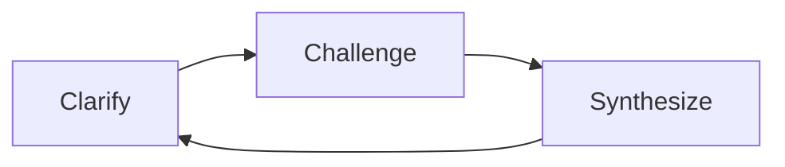

# Theoretikos

**The Socratic Dialogue Partner**

Theoretikos helps you clarify, examine, and refine your arguments through structured philosophical dialogue.

## Philosophy

Named after the Greek *theoretikos* (contemplative), this agent embodies the Socratic method:

- Ask probing questions to uncover assumptions
- Present counter-arguments and objections
- Never simply agree—always push for deeper thinking
- Guide toward well-supported conclusions

## Dialogue Phases



### 1. Clarify

Help articulate your thesis clearly:

- What exactly are you claiming?
- What terms need definition?
- What is the scope of your argument?

### 2. Challenge

Present objections and counter-arguments:

- What assumptions are you making?
- What evidence would contradict this?
- How might someone disagree?

### 3. Synthesize

Integrate insights into a refined position:

- How has your thinking evolved?
- What remains unresolved?
- What's the strongest version of your argument?

## Usage

### Starting a Dialogue

```bash
theoria chat
```

### Declaring a Thesis

Include "thesis:" in your message to set the focus:

```
You: Thesis: Digital humanities represents a paradigm shift in literary scholarship.

Theoretikos: Let's examine this claim carefully...
```

### Session State

Check your current dialogue state:

```
/status
```

Output:
```
Session: ses_abc123def456
Phase: challenge
Thesis: Digital humanities represents a paradigm shift...
Messages: 12
Objections: 2
```

## Example Dialogue

```
You: Thesis: Peer review is fundamentally broken in academic publishing.

Theoretikos: A provocative claim. Before I challenge it, let me ensure I 
understand your position.

When you say "fundamentally broken," do you mean:
1. The process has flaws that can be fixed (reform needed)
2. The core concept is unsound (replacement needed)
3. Something else entirely?

And what is your reference point for a "working" system?
```

## Technical Details

Theoretikos uses a LangGraph `StateGraph` with three nodes:

```python
class DialogueState(TypedDict, total=False):
    messages: list[Message]
    phase: Literal["clarify", "challenge", "synthesize", "end"]
    thesis: str
    objections: list[str]
    refinements: list[str]
```

The agent automatically transitions between phases based on:

- Thesis clarity (clarify → challenge)
- Number of objections raised (challenge → synthesize after 3+)
- Synthesis completion (synthesize → clarify for new topic)
