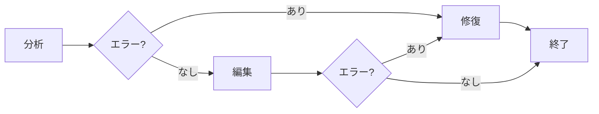

# Graphos（グラフォス）

**LaTeX編集エージェント**

Graphosは、LaTeXドキュメントの編集、構造の一貫性維持、構文エラーの修復を支援します。

## 責務

- 指示に基づいてLaTeXドキュメントを編集
- ドキュメント構造とフォーマットの維持
- 一般的なLaTeX構文エラーの修復
- 既存のスタイルと規約の保持
- 引用、参照、相互参照の適切な処理

## 編集フェーズ



### 1. 分析（Analyze）

ドキュメント構造を理解：

- ドキュメントクラスとパッケージ
- セクション階層
- 既存の規約

### 2. 編集（Edit）

要求された変更を実施：

- ユーザーの指示に従う
- ドキュメントスタイルを保持
- 完全な修正済みドキュメントを出力

### 3. 修復（Repair）

構文エラーを自動修正：

- 閉じられていない環境
- 閉じられていない数式モード
- 閉じられていない中括弧
- 空の引用/参照

## 構文チェック

Graphosは一般的なエラーの組み込み構文検証を含みます：

| パターン | エラー |
|----------|--------|
| `\begin{env}` に対応する `\end{env}` がない | 閉じられていない環境 |
| 閉じられていない単独の `$` | 閉じられていない数式モード |
| `}` のない `{` | 閉じられていない中括弧 |
| `\cite{}` | 空の引用 |
| `\ref{}` | 空の参照 |

## 技術詳細

```python
class EditOperation(TypedDict):
    type: Literal["insert", "replace", "delete"]
    line_start: int
    line_end: int | None
    content: str | None

class LatexState(TypedDict, total=False):
    messages: list[Message]
    file_path: str
    content: str
    phase: Literal["analyze", "edit", "repair", "end"]
    edits: list[EditOperation]
    errors: list[str]
```

### 同期修復

LLM呼び出しなしの迅速な修正：

```python
graphos = Graphos()
repaired, remaining_errors = graphos.repair(latex_content)
```

!!! warning "ステータス: 開発中"
    `edit` コマンドはまだCLIで利用できません。
    Graphosはエージェントとして機能しますが、CLI統合が未完了です。
