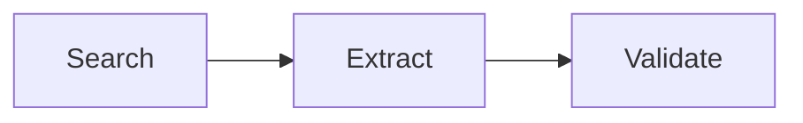

# Bibliographos

**The Literature Search Agent**

Bibliographos assists with finding academic sources, extracting citation metadata, and generating BibTeX entries.

## Responsibilities

- Search for relevant academic sources
- Extract citation metadata
- Generate properly formatted BibTeX entries
- Validate citation completeness
- Maintain citation traceability

## Search Phases



### 1. Search

Find relevant academic sources based on your query:

- Identify key papers and books
- Note authors, years, and venues
- Assess relevance to your research

### 2. Extract

Extract structured citation metadata:

- Generate citation keys (e.g., `smith2023`)
- Determine entry type (article, book, inproceedings)
- Capture all bibliographic fields

### 3. Validate

Verify completeness and format BibTeX:

- Check required fields are present
- Format author names correctly
- Escape special characters
- Ensure unique keys

## BibTeX Output

```bibtex
@article{smith2023,
  author = {Smith, John and Doe, Jane},
  title = {A Study of Something Important},
  year = {2023},
  journal = {Journal of Important Studies},
  volume = {42},
  pages = {1--20},
  doi = {10.1234/example.2023.001}
}
```

## Technical Details

Bibliographos uses a `StateGraph` with citation tracking:

```python
class Citation(TypedDict):
    key: str
    type: str
    title: str
    authors: list[str]
    year: str
    source: str
    doi: str | None
    url: str | None
    abstract: str | None

class SearchState(TypedDict, total=False):
    messages: list[Message]
    query: str
    phase: Literal["search", "extract", "validate", "end"]
    search_results: list[dict[str, Any]]
    citations: list[Citation]
    bib_entries: list[str]
```

!!! warning "Status: In Development"
    The `search` command is not yet available in the CLI. 
    Bibliographos is functional as an agent but lacks CLI integration.
