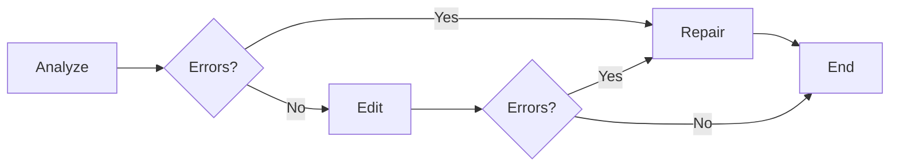

# Graphos

**The LaTeX Editing Agent**

Graphos assists with editing LaTeX documents, maintaining structure consistency, and repairing syntax errors.

## Responsibilities

- Edit LaTeX documents based on instructions
- Maintain document structure and formatting
- Repair common LaTeX syntax errors
- Preserve existing style and conventions
- Handle citations, references, and cross-references

## Edit Phases



### 1. Analyze

Understand the document structure:

- Document class and packages
- Section hierarchy
- Existing conventions

### 2. Edit

Make requested changes:

- Follow user instructions
- Preserve document style
- Output complete modified document

### 3. Repair

Fix syntax errors automatically:

- Unclosed environments
- Unclosed math mode
- Unclosed braces
- Empty citations/references

## Syntax Checking

Graphos includes built-in syntax validation for common errors:

| Pattern | Error |
|---------|-------|
| `\begin{env}` without `\end{env}` | Unclosed environment |
| Single `$` without closing | Unclosed math mode |
| `{` without `}` | Unclosed brace |
| `\cite{}` | Empty citation |
| `\ref{}` | Empty reference |

## Technical Details

```python
class EditOperation(TypedDict):
    type: Literal["insert", "replace", "delete"]
    line_start: int
    line_end: int | None
    content: str | None

class LatexState(TypedDict, total=False):
    messages: list[Message]
    file_path: str
    content: str
    phase: Literal["analyze", "edit", "repair", "end"]
    edits: list[EditOperation]
    errors: list[str]
```

### Synchronous Repair

For quick fixes without LLM calls:

```python
graphos = Graphos()
repaired, remaining_errors = graphos.repair(latex_content)
```

!!! warning "Status: In Development"
    The `edit` command is not yet available in the CLI.
    Graphos is functional as an agent but lacks CLI integration.
