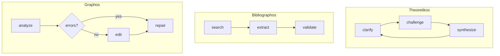

# Architecture

## Project Structure

```
src/theoria/
├── cli.py              # Entry point - Typer app
├── agents/             # LangGraph agents
│   ├── theoretikos.py  # Socratic dialogue
│   ├── bibliographos.py# Literature search
│   └── graphos.py      # LaTeX editing
├── auth/               # API key & OAuth storage
│   ├── store.py        # JSON file storage
│   └── oauth.py        # PKCE/device code flows
├── config/             # Pydantic settings
│   └── loader.py       # Config priority handling
├── providers/          # LiteLLM wrapper
│   └── __init__.py     # LLMClient, Message
├── storage/            # SQLite for sessions
│   └── __init__.py     # SessionStorage
├── bibliography/       # BibTeX management (planned)
└── latex/              # LaTeX utilities (planned)
```

## Agent Architecture

All agents follow the LangGraph `StateGraph` pattern:

```python
class AgentState(TypedDict, total=False):
    messages: list[Message]
    phase: Literal[...]
    # domain-specific fields

class Agent:
    def __init__(self, config: Config | None = None):
        self.client = LLMClient(config)
        self.graph = self._build_graph()
    
    def _build_graph(self) -> StateGraph[AgentState]:
        graph = StateGraph(AgentState)
        # add_node, add_conditional_edges, set_entry_point
        return graph
```

### State Flow



## Configuration Priority

```
Environment Variables (highest)
        ↓
Project Config (./config.theoria.yaml)
        ↓
Global Config (~/.config/theoria/config.yaml)
        ↓
Defaults (lowest)
```

## Data Storage

| Type | Path | Mode | Format |
|------|------|------|--------|
| Global config | `~/.config/theoria/config.yaml` | 644 | YAML |
| Auth tokens | `~/.config/theoria/auth.json` | 600 | JSON |
| Sessions | `~/.config/theoria/sessions.db` | 644 | SQLite |
| Project config | `./config.theoria.yaml` | 644 | YAML |

## LLM Integration

Theoria uses LiteLLM for provider abstraction:

```python
# Provider-agnostic model string resolution
_resolve_model_string("anthropic", "claude-3-sonnet")
# → "anthropic/claude-3-sonnet"

_resolve_model_string("openai", "gpt-4o")
# → "gpt-4o" (no prefix needed)
```

### API Key Resolution

1. Check environment variable (`OPENAI_API_KEY`, etc.)
2. Check stored auth (`~/.config/theoria/auth.json`)
3. Fail with helpful error message

## Session Storage

SQLite schema:

```sql
CREATE TABLE sessions (
    id TEXT PRIMARY KEY,
    title TEXT,
    created_at TEXT NOT NULL,
    updated_at TEXT NOT NULL,
    state_json TEXT NOT NULL
);

CREATE TABLE messages (
    id INTEGER PRIMARY KEY AUTOINCREMENT,
    session_id TEXT NOT NULL,
    role TEXT NOT NULL,
    content TEXT NOT NULL,
    created_at TEXT NOT NULL,
    FOREIGN KEY (session_id) REFERENCES sessions(id)
);
```
