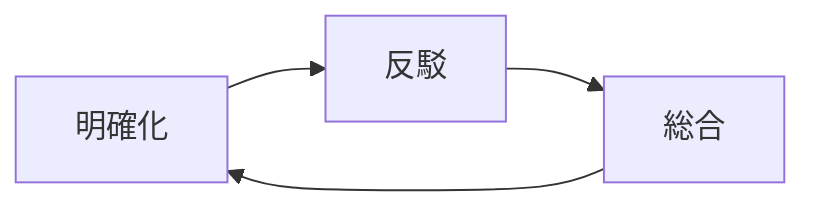

# Theoretikos（テオレティコス）

**ソクラテス式対話パートナー**

Theoretikosは、構造化された哲学的対話を通じて、あなたの論証を明確化し、検討し、洗練させる手助けをします。

## 哲学

ギリシャ語の *theoretikos*（観想的）に由来するこのエージェントは、ソクラテス式対話法を体現します：

- 仮定を明らかにする探究的な質問をする
- 反論や反対意見を提示する
- 単に同意することはしない—常により深い思考を促す
- 十分に裏付けられた結論へと導く

## 対話フェーズ



### 1. 明確化（Clarify）

テーゼを明確に表現する手助け：

- 正確には何を主張しているのか？
- 定義が必要な用語は？
- 議論の範囲は？

### 2. 反駁（Challenge）

反論や反対意見を提示：

- どのような仮定をしているか？
- これを否定する証拠は何か？
- 誰がどのように反対するか？

### 3. 総合（Synthesize）

洞察を統合し、洗練された立場へ：

- 思考はどのように発展したか？
- 未解決の問題は何か？
- 議論の最も強い形は？

## 使い方

### 対話を開始

```bash
theoria chat
```

### テーゼの宣言

メッセージに「thesis:」を含めて焦点を設定：

```
You: Thesis: デジタル人文学は文学研究におけるパラダイムシフトである。

Theoretikos: この主張を注意深く検討してみましょう...
```

### セッション状態

現在の対話状態を確認：

```
/status
```

出力：
```
Session: ses_abc123def456
Phase: challenge
Thesis: デジタル人文学は文学研究における...
Messages: 12
Objections: 2
```

## 対話例

```
You: Thesis: 学術出版における査読制度は根本的に破綻している。

Theoretikos: 挑発的な主張ですね。反駁する前に、あなたの立場を
正確に理解させてください。

「根本的に破綻している」とおっしゃるとき、それは：
1. プロセスに修正可能な欠陥がある（改革が必要）
2. 核心的な概念自体が不健全（代替が必要）
3. それ以外の何か

のどれを意味していますか？

また、「機能している」システムの基準は何でしょうか？
```

## 技術詳細

Theoretikosは3つのノードを持つLangGraph `StateGraph` を使用：

```python
class DialogueState(TypedDict, total=False):
    messages: list[Message]
    phase: Literal["clarify", "challenge", "synthesize", "end"]
    thesis: str
    objections: list[str]
    refinements: list[str]
```

エージェントは以下に基づいて自動的にフェーズを遷移：

- テーゼの明確さ（clarify → challenge）
- 提起された反論の数（3回以上で challenge → synthesize）
- 総合の完了（synthesize → clarify で新しいトピックへ）
