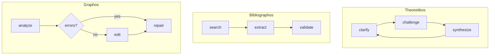

# アーキテクチャ

## プロジェクト構造

```
src/theoria/
├── cli.py              # エントリポイント - Typerアプリ
├── agents/             # LangGraphエージェント
│   ├── theoretikos.py  # ソクラテス式対話
│   ├── bibliographos.py# 文献検索
│   └── graphos.py      # LaTeX編集
├── auth/               # APIキー & OAuth ストレージ
│   ├── store.py        # JSONファイルストレージ
│   └── oauth.py        # PKCE/デバイスコードフロー
├── config/             # Pydantic設定
│   └── loader.py       # 設定優先度処理
├── providers/          # LiteLLMラッパー
│   └── __init__.py     # LLMClient, Message
├── storage/            # セッション用SQLite
│   └── __init__.py     # SessionStorage
├── bibliography/       # BibTeX管理（計画中）
└── latex/              # LaTeXユーティリティ（計画中）
```

## エージェントアーキテクチャ

すべてのエージェントはLangGraph `StateGraph` パターンに従います：

```python
class AgentState(TypedDict, total=False):
    messages: list[Message]
    phase: Literal[...]
    # ドメイン固有フィールド

class Agent:
    def __init__(self, config: Config | None = None):
        self.client = LLMClient(config)
        self.graph = self._build_graph()
    
    def _build_graph(self) -> StateGraph[AgentState]:
        graph = StateGraph(AgentState)
        # add_node, add_conditional_edges, set_entry_point
        return graph
```

### 状態フロー



## 設定優先度

```
環境変数（最優先）
        ↓
プロジェクト設定（./config.theoria.yaml）
        ↓
グローバル設定（~/.config/theoria/config.yaml）
        ↓
デフォルト（最低優先）
```

## データストレージ

| 種類 | パス | モード | 形式 |
|------|------|--------|------|
| グローバル設定 | `~/.config/theoria/config.yaml` | 644 | YAML |
| 認証トークン | `~/.config/theoria/auth.json` | 600 | JSON |
| セッション | `~/.config/theoria/sessions.db` | 644 | SQLite |
| プロジェクト設定 | `./config.theoria.yaml` | 644 | YAML |

## LLM統合

TheoriaはLiteLLMを使用してプロバイダーを抽象化：

```python
# プロバイダー非依存のモデル文字列解決
_resolve_model_string("anthropic", "claude-3-sonnet")
# → "anthropic/claude-3-sonnet"

_resolve_model_string("openai", "gpt-4o")
# → "gpt-4o" （プレフィックス不要）
```

### APIキー解決

1. 環境変数をチェック（`OPENAI_API_KEY` など）
2. 保存された認証をチェック（`~/.config/theoria/auth.json`）
3. 有用なエラーメッセージで失敗

## セッションストレージ

SQLiteスキーマ：

```sql
CREATE TABLE sessions (
    id TEXT PRIMARY KEY,
    title TEXT,
    created_at TEXT NOT NULL,
    updated_at TEXT NOT NULL,
    state_json TEXT NOT NULL
);

CREATE TABLE messages (
    id INTEGER PRIMARY KEY AUTOINCREMENT,
    session_id TEXT NOT NULL,
    role TEXT NOT NULL,
    content TEXT NOT NULL,
    created_at TEXT NOT NULL,
    FOREIGN KEY (session_id) REFERENCES sessions(id)
);
```
